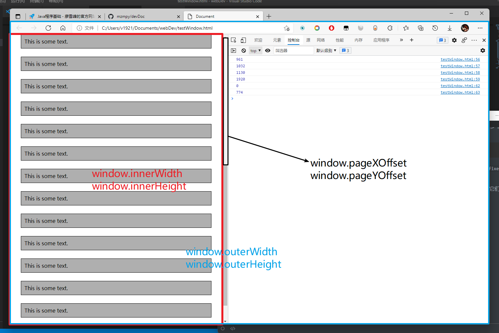

1. `<meta>`是文档级元数据元素；`<meta>`标签提供`HTML`文档的描述，通常用于网页关键词、网页描述、作者、网页编码、robots、自动跳转等的说明，通常它们不能由其它的`HTML`元相关元素（`<base>`、`<link>`、`<script>`、或`<style>`）之一表示的任何元数据信息提供

   

   `<meta>`元素定义的元数据的类型包括以下几种，主要的则是`http-equiv`和`name`：

   ​	a) 若设置了`charset`属性，`meta`元素是一个字符集声明，告诉文档使用哪种字符编码，即网页编码：

   ```html
   <!-- 声明字符集为 utf-8 -->
   <meta charset="utf-8">
   ```

   ​	b) 若设置了`itemprop`属性，`meta`元素提供用户定义的元数据

   ​	c) 若设置了`name`属性，`meta`元素提供的是文档级别（`document-level`）的元数据，应用于描述整个页面，与之对应的属性值为`content`，`content`中的内容主要是便于搜索引擎机器人查找信息和分类信息用的：

   ```html
   <!-- 标注网页作者 -->
   <meta name="author" content="mzm">
   <!-- 页面关键词，用于被搜索引擎收录 -->
   <meta name="keywords" content="关于、网页的、一些、关键词">
   <!-- 页面描述，用于搜索引擎收录 -->
   <meta name="description" content="关于网页的简短而比较详细的描述">
   <!-- 用于控制页面缩放 -->
   <meta name="viewport" content="width=devide-width, initial-scale=1, maximum-scale=1, minimum-scale=1, user-scalable=no">
   <!-- 用于描述网站使用什么软件生成 -->
   <meta name="generator" content="Microsoft">
   <!-- 指定双核浏览器默认以何种方式渲染页面 -->
   	<!-- 默认webkit内核 -->
   <meta name="renderer" content="webkit">
   	<!-- 默认IE兼容模式 -->
   <meta name="renderer" content="ie-comp">
   	<!-- 默认IE标准模式 -->
   <meta name="renderer" content="ie-stand">
   <!-- 标注网页文档修改时间 -->
   <meta name="revised" content="07/24/2021">
   <!-- 用来告诉搜索机器人哪些页面需要索引，哪些页面不需要索引；
   取值：all|none|index|noindex|follow|nofollow, 默认all
   all：文件将被检索，且页面上的链接可以被查询；
   none：文件将不被检索，且页面上的链接不可以被查询；
   index：文件将被检索；
   follow：页面上的链接可以被查询；
   noindex：文件将不被检索，但页面上的链接可以被查询；
   nofollow：文件将不被检索，页面上的链接可以被查询 -->
   <meta name="robots" content="none">
   <!-- 标注网站版权信息 -->
   <meta name="copyright" content="本页版权归XXX所有, All Rights Reserve">
   ```

   d) 若设置了`http-equiv属性`，`meta`元素则是编译指令，提供的信息与类似命名的`HTTP`头部相同：

   ```html
   <meta http-equiv="Content-Type" content="text/html; charset=utf-8">
   <!-- 告诉IE浏览器，IE8/9及以后的版本都会以最高版本IE来渲染页面 -->
   <meta http-equiv="X-UA-Compatible" content="IE=edge">
   <!-- 网页过期时间 -->
   <meta http-equiv="Expires" content="Wed, 20 Jun 2007 22:33:00 GMT">
   <!-- 2秒后自动跳转到https://www.baidu.com -->
   <meta http-equiv="Refresh" content="2; url=https://www.baidu.com">
   <!-- 删除 cookie -->
   <meta http-equiv="Set-Cookie" content="cookievalue=xxx; expires=Wednesday, 20-Jun-2007 22:33:00 GMT; path=/">
   <!-- 强制页面在当前窗口中以独立页面显示，可以防止自己的网页被别人当作一个frame页调用 -->
   <meta http-equiv="Window-target" content="_top">
   ```

   

2. `rowspan`作为表格单元的属性可设置表格单元横跨的行数；类似的，`colspan`属性可设置或返回表格单元横跨的列数

3. `transform`是让我们能够旋转、平移、扭曲、按比例缩放元素的`CSS`属性，其值可以是`none`或一个（或者多个）`<transform-function>`：

   ```css
   transform: transform-function
   ```

   对于`transform`属性非`none`值的元素，其上将建立栈上下文，它将作为包含在它内部的`position`属性为`fixed`或`absolute`的元素的容器

4. 对于`DOM`元素的操作，如通过`getElement*`、`querySelector*`等获取的`DOM`，特别是动态渲染的，务必在它们渲染完成后再对其进行操作

5. 通过`document.defaultView`或者全局变量`window`获取`Window`对象：

   * `innerWidth`：获取当前窗口（`viewport`）内容区域的宽度

   * `innerHeight`：获取当前窗口（`viewport`）内容区域的高度

   * `outerWidth`：获取当前窗口（`viewport`）内容区域的宽度

   * `outerHeight`：获取当前窗口（`viewport`）内容区域的高度

   * `pageXOffset`：获取当前窗口（`viewport`）从左上角算起水平滚动过的像素数

   * `pageYOffset`：获取当前窗口（`viewport`）从左上角算起垂直滚动过的像素数

     

6. `Ajax`核心规范的名称继承于你用来建立和发起请求的`Javascript`对象：`XMLHttpRequest`

7. 一个简单的`Ajax`示例：用户点击按钮，浏览器在后台向服务器请求一个文档，当它到达时你处理一个事件，并显示被请求文档的内容

8. `XMLHttpRequest`对象定义的事件：

   * `readystatechange`：在请求过程中会被多次触发

     * `UNSET`：数值为`0`，创建`XMLHttpRequest`对象时触发
     * `OPENED`：数值为`1`，调用`open`方法时触发
     * `HEADERS_RECEIVED`：数值为`2`，收到服务器响应的标头时触发
     * `LOADING`：数值为`3`，接受服务器响应数据时触发
     * `DONE`：数值为`4`，响应完成或失败时触发

   * `abort`：在请求被终止时触发

   * `error`：在请求失败时触发

   * `load`：在请求成功时触发

   * `loadend`：在请求已完成（无论请求成功还是失败）时触发

   * `loadstart`：在请求开始时触发

   * `timeout`：在请求超时时触发

   * `progress`：上传期间定时触发已提示请求进度

   * 注：除了`readystatechange`外，其它事件都定义于`XMLHttpRequest`规范的第二级，也就是说只有`readystatechange`是被所有浏览器完整支持的；其中`readystatechange`是`Event`类型事件，其它的则是`ProgressEvent`类型事件，`ProgressEvent`对象定义了`Event`的所有成员，同时还增加了：

     * `lengthComputable`：若可计算数据流的长度则返回`true`
     * `loaded`：返回当前已载入数据量
     * `total`：返回可用的数据量总量

     使用`XMLHttpRequest.upload`的上面提到的几个事件可以很好地跟踪上传进度

9. 
